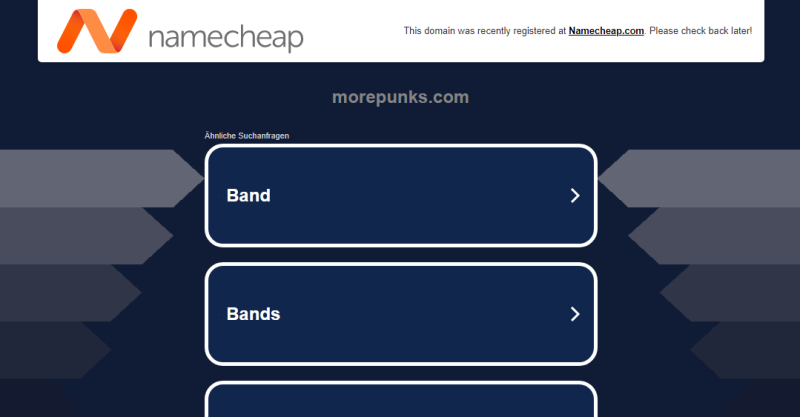
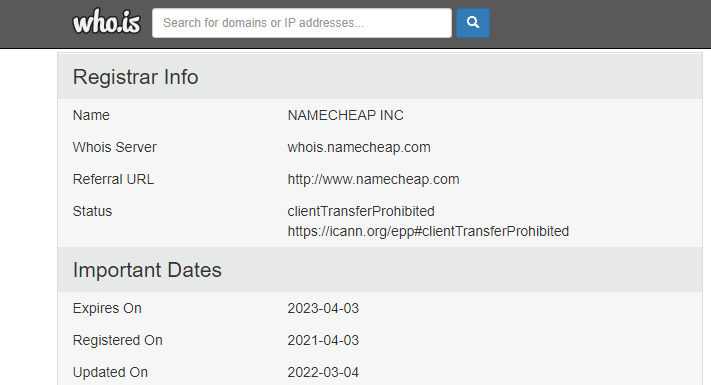
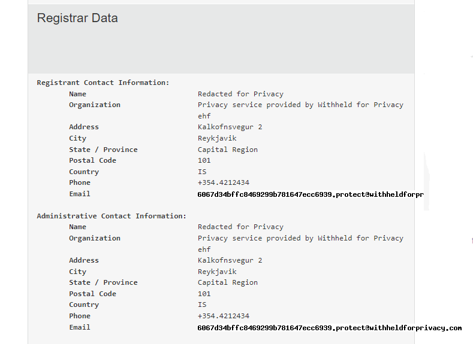

#  Who's the "More Punks" Crypto Bro?

This absurdity here on github and on reddit
is a far as I can tell caused (and driven) by
"More Punks".

Thus, the big question who is (behind) "More Punks"?

Let's start with the website - <http://www.morepunks.com/>

Okkie that's gone  (maybe the internet archive has a copy of the "one-page" website?)

Let's check the domain service name (dns) record via who.is - <https://who.is/whois/morepunks.com>

The record says "Expires On 2023-04-03",
that is, April 3rd 2023 (!) that is a date in the PAST  (I am writing this on April 7th, 2023).

Let's move to the twitter handle  - <https://twitter.com/MorePunks>

As of April 7th, 2023 - the latest posting (tweet) is from Feb 12th, 2023.

The link tree reads - see <https://linktr.ee/morepunks>:

> Check out all of our collections on OpenSea!
>
> - MorePunks (Opensea)     @ <https://opensea.io/collection/morepunks>
>   -  1007 Items / Created Apr 2021 /  Creator earnings 10%
>
> - MorePunks Outfits (Opensea)   @ <https://opensea.io/collection/morepunks-outfits>
>   - 10 Items  / Created Feb 2022 /  Creator earnings 10%
>
> - CryptoGreats (Opensea)   @ <https://opensea.io/collection/cryptogreats>
>   - 931 Items /  Created Mar 2021 / Creator earnings 10%
>
>
> - Celebrity Sports Punks (Opensea) @ <https://opensea.io/collection/celebrity-sports-punks>
>   - 490 Unique items / 4900 Total items / Created Mar 2022 / Creator earnings 10%
>
>
>
> - Play MorePunks 2048!   @ <https://create2048.com/game.php/?game=morepunks>

Note:  All collections on opensea are sold via the (builtin shared) OPENSTORE open sea contract.

And for the record - more social media accounts known to be "managed" by MorePunks

- <https://twitter.com/cryptogreats>

As of April 7th, 2023 - the latest posting (tweet) is from July 16th, 2022.

- <https://twitter.com/CelebSportPunks>

As of April 7th, 2023 - the latest posting (tweet) is from July 16th, 2022.

- <https://www.instagram.com/CryptoGreats/> - 939 posts, 231 followers, 18 following

And finally let's check the (crypto ethereum) acccount
on open sea <https://opensea.io/MorePunks> - here's where the money gets into "More Punks" pockets.

The linked ethereum account is [**<0xa4ABF37c95DD90e1f4FD2Bc5D519d9dEeA19609c>**](https://etherscan.io/address/0xa4ABF37c95DD90e1f4FD2Bc5D519d9dEeA19609c)
and it shows tens of thousands of dollars rolling in (in ETH)
and holding as of April 7th, 2023 -  ~US$ 40 000+ in ETH, ~US$ 20 000+ in USDC, ...

The blurb reads:

> Creator of MorePunks, CryptoGreats & THICC YU-GI-OH! Cards

For the latest activity, see <https://opensea.io/MorePunks/activity>

As of April 7th, 2023 - the latest activity is listing of Crypto Greats (for sale) on Feb 21st, 2023.

Anyways, to repeat I never got any private message from "More Punks"
before or after the attacks on github or reddit.

If anyone has any news or inside info about "More Punks", please help (and tell).

